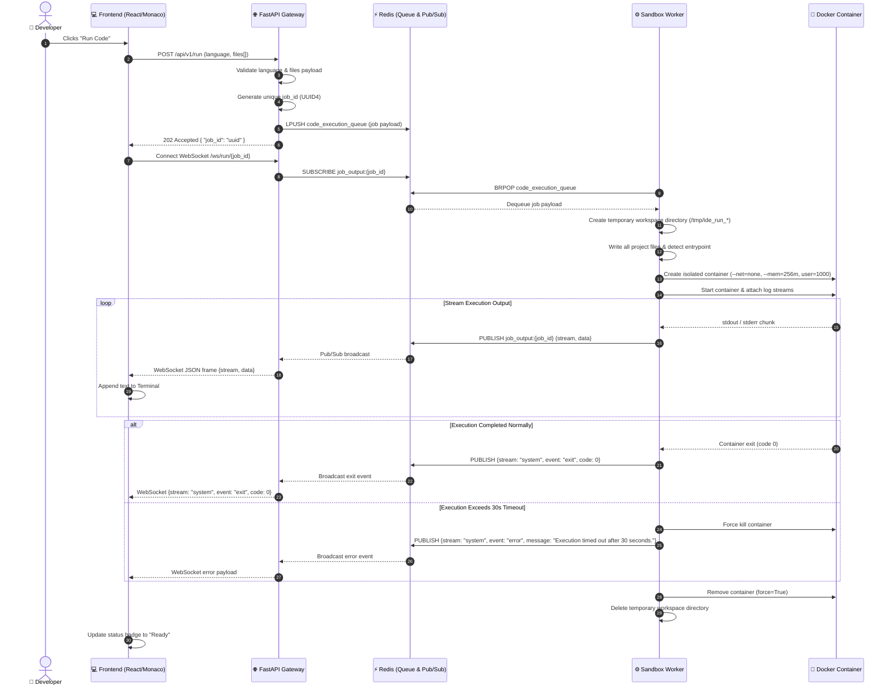
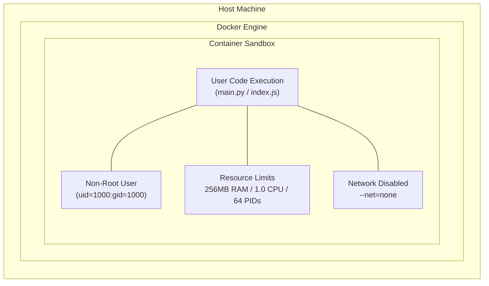
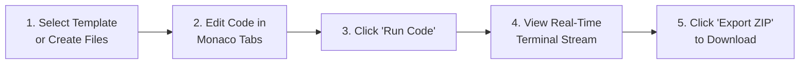

# ⚡ Browser-Based Mini IDE with Docker Sandbox & Real-Time Output

<div align="center">


<p align="center">
  <strong>A high-performance, cloud-native browser IDE for multi-file Python and JavaScript execution inside isolated Docker sandboxes with sub-millisecond WebSocket output streaming.</strong>
</p>

[Architecture Details](architecture.md) • [Project Documentation](projectdocumentation.md) • [Questionnaire Answers](answers.md)

</div>

---

## 📑 Table of Contents
- [🌟 Key Highlights](#-key-highlights)
- [🏗 System Architecture](#-system-architecture)
- [🔄 End-to-End Execution Flow](#-end-to-end-execution-flow)
- [🛠 Tech Stack & Rationale](#-tech-stack--rationale)
- [📂 Code Structure & Organization](#-code-structure--organization)
- [🛡 Sandbox Security Model](#-sandbox-security-model)
- [🚀 Quick Start & Installation](#-quick-start--installation)
- [💻 Usage Instructions & Workflow](#-usage-instructions--workflow)
- [🧪 Automated Testing Strategy](#-automated-testing-strategy)
- [📡 API & WebSocket Protocol](#-api--websocket-protocol)

---

## 🌟 Key Highlights

- 🖥 **Monaco Code Editor**: Powered by the same editor engine as VS Code, featuring syntax highlighting, indentation, multi-tab switching, and language auto-detection.
- 📁 **Hierarchical File Explorer**: Real-time tree navigation with full support for creating, renaming, and deleting files and nested folders.
- 🐳 **Secure Ephemeral Docker Sandbox**: Every run executes inside a freshly spawned, isolated container (`python:3.10-slim` or `node:18-alpine`) with `--net=none`, CPU/Memory quotas, non-root user permissions, and automatic container destruction.
- ⚡ **Real-Time Streaming Terminal**: Live WebSocket log forwarding with discrete stdout/stderr channels, execution status badges, exit codes, and auto-scrolling terminal.
- 🎨 **Starter Project Gallery**: One-click starter templates for Python algorithms, data processing pipelines, and ES-Module Node.js CLIs.
- 📦 **One-Click Project Export**: Client-side ZIP bundle packaging using JSZip for instant offline downloads.
- ⏱ **Watchdog Timeout Enforcement**: Automatic 30-second execution kill guard preventing infinite loops and compute exhaustion.

---

## 🏗 System Architecture

The application adopts a decoupled, event-driven microservices architecture composed of four core containers orchestrated via Docker Compose:

```mermaid
flowchart TB
    subgraph Client["🖥 Client Browser (Frontend SPA)"]
        UI["React 18 UI / Tailwind"]
        Monaco["Monaco Multi-Tab Editor"]
        Tree["File Tree Component"]
        Term["Real-Time Terminal"]
        WSClient["WebSocket Client"]
    end

    subgraph Gateway["🌐 API Gateway Service"]
        FastAPI["FastAPI App (:8000)"]
        Validator["Pydantic Payload Validator"]
        WSServer["WebSocket Hub (/ws/run/{id})"]
    end

    subgraph Broker["⚡ Message Broker"]
        Queue[("Redis Queue: code_execution_queue")]
        PubSub[("Redis Pub/Sub: job_output:{id}")]
        History[("Redis History: job_history:{id}")]
    end

    subgraph WorkerService["⚙ Sandbox Worker Service"]
        Consumer["Queue Consumer Loop"]
        Runner["Sandbox Runner Engine"]
        Watchdog["30s Timeout Watchdog"]
    end

    subgraph Sandbox["🐳 Docker Isolation Layer"]
        PyBox["Python Sandbox Container\n--net=none | --mem=256m | non-root"]
        NodeBox["Node.js Sandbox Container\n--net=none | --mem=256m | non-root"]
    end

    UI -->|1. POST /api/v1/run| FastAPI
    FastAPI --> Validator
    Validator -->|2. LPUSH job payload| Queue
    FastAPI -->|3. Return 202 job_id| UI
    UI -->|4. Connect ws://host/ws/run/{id}| WSServer

    Queue -->|5. BRPOP job| Consumer
    Consumer --> Runner
    Runner --> Watchdog
    Runner -->|6. Spawn Container| PyBox
    Runner -->|6. Spawn Container| NodeBox

    PyBox -->|7. Stdout / Stderr Streams| Runner
    NodeBox -->|7. Stdout / Stderr Streams| Runner
    Runner -->|8. PUBLISH chunk & RPUSH history| PubSub
    Runner --> History

    PubSub -->|9. Forward chunk| WSServer
    WSServer -->|10. Stream JSON frame| WSClient
    WSClient --> Term
```

---

## 🔄 End-to-End Execution Flow



---

## 🛠 Tech Stack & Rationale

| Domain | Technology | Version | Purpose & Rationale |
|---|---|---|---|
| **Frontend Framework** | React + TypeScript | 18.2 / 5.3 | High performance, component reusability, and strict type safety. |
| **Bundler & Tooling** | Vite | 5.1 | Instant hot-module reloading (HMR) and optimized build bundling. |
| **Code Editor** | Monaco Editor | 4.6 | VS Code editor core with language syntax parsing and multi-buffer state. |
| **Styling** | Tailwind CSS | 3.4 | Clean, customizable dark theme with responsive flexbox and grid layouts. |
| **Archive Utility** | JSZip + FileSaver | 3.10 / 2.0 | Zero-backend client-side ZIP compilation and file downloading. |
| **Backend API Gateway** | FastAPI | 0.110 | Asynchronous Python web framework with native WebSocket support and Pydantic validation. |
| **ASGI Web Server** | Uvicorn (standard) | 0.28 | Lightning-fast async event loop using `uvloop` for high-concurrency WebSocket multiplexing. |
| **Job Queue & Broker** | Redis | 7-alpine | In-memory message queue (`LPUSH`/`BRPOP`) and real-time Pub/Sub log distribution. |
| **Worker Engine** | Python + Docker SDK | 3.11 / 7.0 | Ephemeral container lifecycle management, pipe streaming, and timeout watchdog. |
| **Containerization** | Docker & Compose | 3.8 Spec | Multi-service orchestration with health checks and dependency management. |

---

## 📂 Code Structure & Organization

```
Gpp-39/
├── .env.example                  # Environment configuration template
├── .gitignore                    # Git ignore specifications
├── docker-compose.yml            # Multi-service stack orchestration (frontend, api, queue, worker)
├── README.md                     # Visual documentation & quick-start guide
├── architecture.md               # Detailed system architecture and design documentation
├── projectdocumentation.md       # Comprehensive project & API specification
├── answers.md                    # Detailed architectural questionnaire responses
├── backend/
│   ├── __init__.py               # Backend root package
│   ├── api/                      # FastAPI Gateway Service
│   │   ├── Dockerfile            # Container definition for API
│   │   ├── requirements.txt      # API dependencies (FastAPI, uvicorn, redis, httpx)
│   │   ├── config.py             # Environment configuration variables
│   │   └── main.py               # Routes: /health, POST /api/v1/run, WebSocket /ws/run/{id}
│   └── worker/                   # Sandbox Worker Service
│       ├── Dockerfile            # Container definition for Worker
│       ├── requirements.txt      # Worker dependencies (docker, redis)
│       ├── config.py             # Worker timeout & image settings
│       ├── runner.py             # Docker container execution, pipe streaming, cleanup
│       └── worker.py             # Redis consumer loop with signal handling & heartbeat
├── frontend/
│   ├── Dockerfile                # Production multi-stage build with Nginx
│   ├── nginx.conf                # Nginx reverse proxy & WebSocket upgrade config
│   ├── package.json              # NPM dependencies & build scripts
│   ├── index.html                # SPA HTML template
│   ├── tsconfig.json             # TypeScript compiler settings
│   ├── vite.config.ts            # Vite configuration
│   ├── tailwind.config.js        # Tailwind CSS theme configuration
│   ├── postcss.config.js         # PostCSS plugins
│   └── src/
│       ├── App.tsx               # Central application state & layout coordinator
│       ├── main.tsx              # React DOM entrypoint
│       ├── index.css             # Global styles & custom scrollbars
│       ├── types.ts              # TypeScript interfaces (ProjectFile, ExecutionLog, etc.)
│       ├── templates.ts          # Starter multi-file project templates
│       ├── components/
│       │   ├── Header.tsx        # Top navigation, language selector, template picker, run button
│       │   ├── FileTree.tsx      # Hierarchical explorer with create/rename/delete
│       │   ├── EditorTabs.tsx    # Multi-tab navigation bar
│       │   ├── CodeEditor.tsx    # Monaco editor integration
│       │   └── Terminal.tsx      # Real-time streaming log terminal
│       └── utils/
│           └── exportZip.ts      # JSZip project export utility
└── tests/
    ├── test_api.py               # API unit tests (health check, validations, 202 responses)
    └── test_execution.py         # Multi-file execution, stderr capture & timeout tests
```

---

## 🛡 Sandbox Security Model



| Security Dimension | Enforcement Mechanism | Security Guarantee |
|---|---|---|
| **Process Isolation** | Independent container spawned per job | Prevents process cross-contamination and host inspection. |
| **Network Restriction** | `network_mode="none"` (`--net=none`) | Eliminates data exfiltration, C2 communication, and LAN port scanning. |
| **Memory Limitation** | `mem_limit="256m"` | Protects host from memory leaks and out-of-memory crashes. |
| **CPU Limitation** | `nano_cpus=1000000000` (1 Core) | Prevents CPU starvation and cryptomining denial of service. |
| **Process Table Caps** | `pids_limit=64` | Completely halts recursive process fork bombs (`:(){ :|:& };:`). |
| **User Privileges** | `user="1000:1000"` (`nobody`) | Blocks root privilege escalation container escapes. |
| **Execution Watchdog** | Hard 30-Second Worker Watchdog | Terminates infinite loops (`while True: pass`) and unlocks worker threads. |
| **Workspace Disposal** | Strict `try...finally` Cleanup | Guaranteed immediate purge of container and temporary host filesystem directories. |

---

## 🚀 Quick Start & Installation

### Prerequisites
- [Docker Engine & Docker Compose](https://docs.docker.com/get-docker/) (v20.10+ / Compose v2.0+)
- [Git](https://git-scm.com/)

### 1. Clone Repository & Prepare Environment
```bash
git clone https://github.com/ramalokeshreddyp/browser-mini-ide-docker-sandbox.git
cd browser-mini-ide-docker-sandbox

# Copy the sample environment file
cp .env.example .env
```

### 2. Launch Entire Multi-Container Stack
```bash
docker-compose up --build
```

### 3. Access Application Services
- 🌐 **Frontend Mini IDE**: [http://localhost:3000](http://localhost:3000)
- 🔌 **FastAPI Backend Gateway**: [http://localhost:8000](http://localhost:8000)
- 🩺 **API Health Check**: [http://localhost:8000/health](http://localhost:8000/health)
- ⚡ **Redis Message Broker**: `localhost:6379`

### 4. Stop All Services
```bash
docker-compose down -v
```

---

## 💻 Usage Instructions & Workflow



1. **Load Starter Projects**:
   - Click the **Templates** dropdown in the header and pick from `Python Math & Greetings`, `Python Data Processing Pipeline`, or `JavaScript / Node.js Modular CLI`.
2. **Manage Files & Folders**:
   - Use the `+` icons in the **Explorer** sidebar to create new files or subdirectories.
   - Click on file items to open them in editor tabs.
   - Click the pencil icon to rename an item or trash icon to delete it.
3. **Execute Code in Sandbox**:
   - Click the green **Run Code** button.
   - The status badge changes to *Executing in Sandbox...* while stdout, stderr, and system notifications stream live in the terminal panel below.
4. **Export Project**:
   - Click **Export ZIP** in the top navigation bar to instantly download the full project directory structure as a `.zip` archive.

---

## 🧪 Automated Testing Strategy

A comprehensive automated test suite validates the entire API gateway, payload validation logic, worker runner, multi-file execution, stderr capture, and 30-second timeout enforcement.

```bash
# Run pytest test suite
python -m pytest tests/ -v
```

### Test Results Breakdown:
```text
============================= test session starts =============================
platform win32 -- Python 3.13.0, pytest-9.1.1
collected 9 items

tests/test_api.py::test_health_check PASSED                              [ 11%]
tests/test_api.py::test_run_valid_python_request PASSED                  [ 22%]
tests/test_api.py::test_run_valid_javascript_request PASSED              [ 33%]
tests/test_api.py::test_run_unsupported_language PASSED                  [ 44%]
tests/test_api.py::test_run_empty_files_list PASSED                      [ 55%]
tests/test_execution.py::test_multifile_python_execution PASSED          [ 66%]
tests/test_execution.py::test_multifile_javascript_execution PASSED      [ 77%]
tests/test_execution.py::test_stderr_capture PASSED                      [ 88%]
tests/test_execution.py::test_timeout_handling PASSED                    [100%]

============================== 9 passed in 2.30s ==============================
```

---

## 📡 API & WebSocket Protocol

### 1. Submit Execution Request
- **Endpoint**: `POST /api/v1/run`
- **Request Body**:
```json
{
  "language": "python",
  "files": [
    {
      "path": "main.py",
      "content": "from utils import greet\nprint(greet('World'))"
    },
    {
      "path": "utils.py",
      "content": "def greet(name):\n    return f'Hello, {name}!'"
    }
  ]
}
```
- **Response `202 Accepted`**:
```json
{
  "job_id": "8fa216c8-527e-4029-a5c6-b3e157771761"
}
```

### 2. Real-Time WebSocket Streaming
- **Endpoint**: `WebSocket /ws/run/{job_id}`
- **Message Schemas**:
  - **Stdout chunk**:
    `{ "stream": "stdout", "data": "Hello, World!\n" }`
  - **Stderr chunk**:
    `{ "stream": "stderr", "data": "Error: Cannot find module...\n" }`
  - **Exit event**:
    `{ "stream": "system", "event": "exit", "code": 0 }`
  - **Timeout error event**:
    `{ "stream": "system", "event": "error", "message": "Execution timed out after 30 seconds." }`

---

<div align="center">
  <sub>Built with ❤️ for High-Performance Cloud Computing and Secure Containerized Execution.</sub>
</div>
