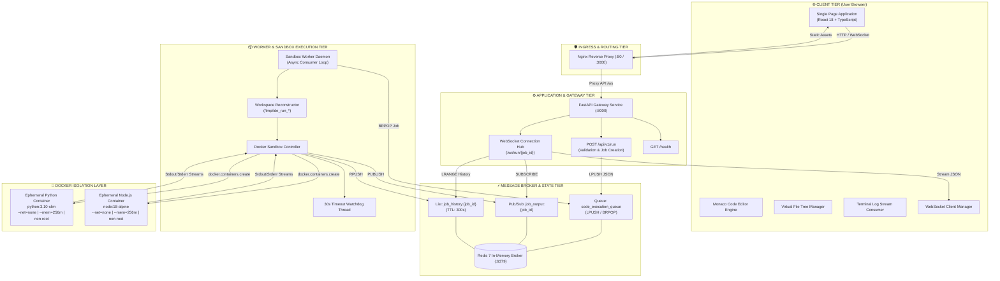
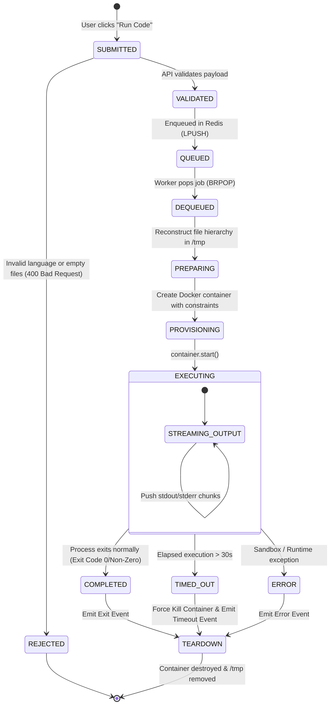
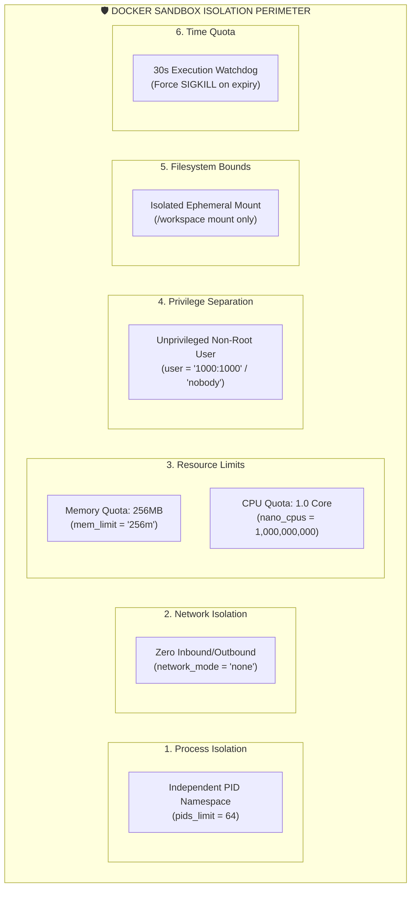
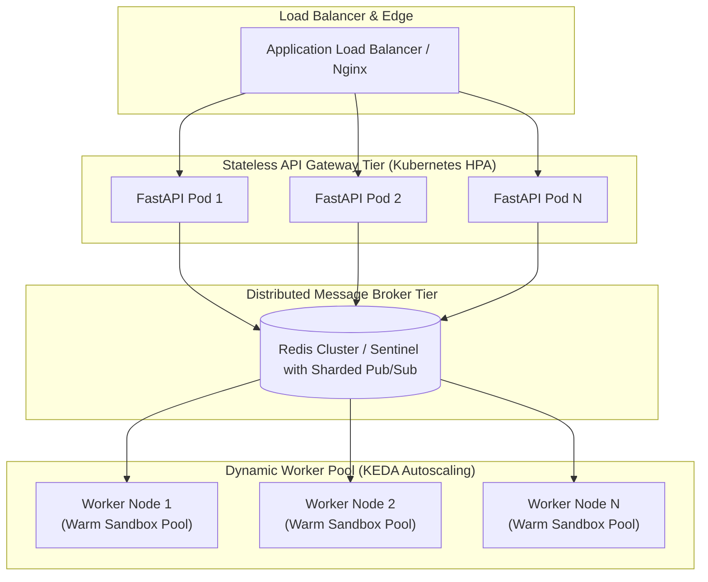

# 🏛 System Architecture & Design Specification

This document provides a deep, comprehensive architectural breakdown of the **Browser-Based Mini IDE with Docker Sandbox and Real-Time Output**. It details the distributed system topology, communication protocols, execution lifecycle, sandboxing security mechanisms, failure modes, and horizontal scaling strategies.

---

## 📑 Table of Contents
1. [Executive Summary & Objectives](#1-executive-summary--objectives)
2. [High-Level Architecture Topology](#2-high-level-architecture-topology)
3. [Component Breakdown & Responsibilities](#3-component-breakdown--responsibilities)
4. [Execution & Data Flow Sequence](#4-execution--data-flow-sequence)
5. [Job State Machine Lifecycle](#5-job-state-machine-lifecycle)
6. [Docker Sandboxing & Security Architecture](#6-docker-sandboxing--security-architecture)
7. [Technology Stack Justification & Trade-Offs Matrix](#7-technology-stack-justification--trade-offs-matrix)
8. [Scalability & High-Concurrency Design](#8-scalability--high-concurrency-design)
9. [Fault Tolerance & Resiliency Matrix](#9-fault-tolerance--resiliency-matrix)

---

## 1. Executive Summary & Objectives

The primary objective of the Mini IDE is to provide an interactive, browser-native development environment capable of safely executing arbitrary multi-file Python and JavaScript code projects without compromising host security or server responsiveness.

### Key Architectural Tenets:
- **Zero API Blocking**: The web gateway never executes code synchronously; code execution is decoupled via an asynchronous message queue.
- **Strict Tenant Isolation**: User-submitted code runs in ephemeral, disposable Docker containers with zero network access and strict resource quotas.
- **Sub-Millisecond Real-Time Feedback**: Standard output and standard error streams are multiplexed and pushed to the browser via low-latency WebSockets.
- **Fail-Safe Resource Reclaim**: Ephemeral workspaces and containers are guaranteed to be destroyed even in the event of timeouts, crashes, or unhandled process exceptions.

---

## 2. High-Level Architecture Topology

---

## 3. Component Breakdown & Responsibilities

### 3.1. Frontend Single Page Application (SPA)
- **Role**: Provides the IDE graphical interface.
- **Key Modules**:
  - `App.tsx`: Central coordinator managing project file state, active tabs, execution lifecycle, and WebSocket subscriptions.
  - `FileTree.tsx`: Hierarchical visual tree with dynamic folder branching, inline file creation, renaming, and deletion.
  - `CodeEditor.tsx`: Monaco Editor integration with dynamic syntax highlighting, indentation, and buffer switching.
  - `Terminal.tsx`: Terminal-style output panel rendering colored stdout, stderr, and system events with auto-scroll.
  - `exportZip.ts`: Client-side ZIP compilation using JSZip.

### 3.2. API Gateway Service (FastAPI)
- **Role**: Ingestion gateway and WebSocket multiplexer.
- **Key Endpoints**:
  - `POST /api/v1/run`: Validates payload schema via Pydantic, generates UUID4 `job_id`, pushes job to Redis queue, returns `202 Accepted`.
  - `GET /health`: Health probe endpoint for Docker orchestration.
  - `WebSocket /ws/run/{job_id}`: Subscribes to Redis Pub/Sub channel and streams JSON messages to connected browser client. Replays buffered history from `job_history:{job_id}`.

### 3.3. Message Broker (Redis)
- **Role**: Decouples API from execution workers and distributes log events.
- **Data Structures Used**:
  - `code_execution_queue` (List): FIFO queue for incoming execution jobs.
  - `job_output:{job_id}` (Pub/Sub): Real-time broadcast channel for log chunks.
  - `job_history:{job_id}` (List with 300s TTL): Buffer storing all emitted events to ensure zero log loss for late WebSocket connections.

### 3.4. Sandbox Worker Daemon
- **Role**: Long-running background worker consuming jobs and managing Docker execution.
- **Key Responsibilities**:
  - Dequeuing jobs using non-blocking/blocking pops (`BRPOP`).
  - Creating temporary host workspace directories (`tempfile.mkdtemp`).
  - Writing multi-file directory structures and auto-injecting module configurations (e.g. `package.json` with `"type": "module"` for ES imports).
  - Provisioning secure, resource-bounded Docker containers.
  - Attaching threads to stdout and stderr streams and pushing chunks to Redis.
  - Enforcing hard 30-second execution timeouts.
  - Guaranteed teardown of containers and host directories in `finally` blocks.

---

## 4. Execution & Data Flow Sequence

```mermaid
sequenceDiagram
    autonumber
    actor Dev as Developer (Browser)
    participant FE as Frontend (React/Monaco)
    participant API as FastAPI Gateway
    participant Redis as Redis (Queue & PubSub)
    participant Worker as Sandbox Worker
    participant Docker as Docker Sandbox

    Dev->>FE: Edits code & clicks "Run Code"
    FE->>API: HTTP POST /api/v1/run { language, files: [{path, content}] }
    
    rect rgb(30, 41, 59)
        Note over API: Gateway Ingestion
        API->>API: Validate language ("python" | "javascript")
        API->>API: Validate files (length > 0)
        API->>API: Generate UUID4 job_id
        API->>Redis: LPUSH code_execution_queue { job_id, language, files }
        API-->>FE: HTTP 202 Accepted { "job_id": "uuid" }
    end

    FE->>API: Establish WebSocket /ws/run/{job_id}
    API->>Redis: SUBSCRIBE job_output:{job_id}
    API->>Redis: LRANGE job_history:{job_id} 0 -1 (Replay early logs)

    rect rgb(15, 23, 42)
        Note over Worker,Docker: Sandbox Execution
        Worker->>Redis: BRPOP code_execution_queue
        Redis-->>Worker: Dequeue Job Payload
        Worker->>Worker: mkdtemp(/tmp/ide_run_{job_id}_*)
        Worker->>Worker: Write all project files & determine entrypoint
        Worker->>Docker: docker.containers.create(image, command, --net=none, --mem=256m, user=1000)
        Worker->>Docker: container.start()
        
        par Stdout Stream
            Docker-->>Worker: Stdout log chunks
            Worker->>Redis: PUBLISH job_output:{job_id} {stream: "stdout", data: chunk}
            Worker->>Redis: RPUSH job_history:{job_id}
            Redis-->>API: PubSub delivery
            API-->>FE: WS frame {stream: "stdout", data: chunk}
            FE->>Dev: Render stdout in Terminal
        and Stderr Stream
            Docker-->>Worker: Stderr log chunks
            Worker->>Redis: PUBLISH job_output:{job_id} {stream: "stderr", data: chunk}
            Worker->>Redis: RPUSH job_history:{job_id}
            Redis-->>API: PubSub delivery
            API-->>FE: WS frame {stream: "stderr", data: chunk}
            FE->>Dev: Render stderr (red text) in Terminal
        end
    end

    rect rgb(30, 41, 59)
        Note over Worker,FE: Lifecycle Completion & Teardown
        alt Normal Exit
            Docker-->>Worker: Exit code 0
            Worker->>Redis: PUBLISH {stream: "system", event: "exit", code: 0}
            Redis-->>API: PubSub exit event
            API-->>FE: WS frame {stream: "system", event: "exit", code: 0}
        else Timeout Exceeded (>30s)
            Worker->>Docker: container.kill()
            Worker->>Redis: PUBLISH {stream: "system", event: "error", message: "Execution timed out after 30 seconds."}
            Redis-->>API: PubSub timeout event
            API-->>FE: WS frame {stream: "system", event: "error", ...}
        end
        Worker->>Docker: container.remove(force=True)
        Worker->>Worker: rmtree(temp_dir)
        FE->>Dev: Display process completion badge
    end
```

---

## 5. Job State Machine Lifecycle

---

## 6. Docker Sandboxing & Security Architecture

The sandbox implements defense-in-depth isolation across six orthogonal dimensions:

---

## 7. Technology Stack Justification & Trade-Offs Matrix

| Technology | Alternative Considered | Selected Rationale | Trade-Off Accepted |
|---|---|---|---|
| **FastAPI** | Express.js / Django | Native asynchronous WebSocket support, strict Pydantic payload validation, high throughput on ASGI (`uvicorn`). | Requires Python runtime in API container. |
| **Redis** | RabbitMQ / Kafka | Combined lightweight job queue (`LPUSH`/`BRPOP`) and high-throughput real-time Pub/Sub in a single 30MB alpine container. | In-memory storage without complex AMQP message routing features (unneeded for this scale). |
| **WebSockets** | Server-Sent Events (SSE) | True bidirectional capability allowing future interactive terminal `stdin` input; sub-millisecond JSON framing. | Requires explicit connection upgrade and reverse-proxy header forwarding (`Upgrade`/`Connection`). |
| **Monaco Editor** | CodeMirror 6 / Ace | Industry-standard VS Code engine with built-in IntelliSense, syntax tokenizers, multi-buffer support, and minimap controls. | Larger client bundle size compared to CodeMirror. |
| **Docker SDK** | Direct Shell Subprocess | Full OS-level container isolation, process cgroups, namespace virtualization, and CPU/Memory limits. | Higher container startup latency (~300ms cold start) compared to bare processes. |

---

## 8. Scalability & High-Concurrency Design

### Key Scaling Strategies:
1. **Stateless API Gateway**: API instances share no state. WebSocket connections can be load-balanced across $N$ nodes using sticky sessions or Redis Pub/Sub fan-out.
2. **KEDA Worker Autoscaling**: Kubernetes Event-Driven Autoscaler monitors queue length (`LLEN code_execution_queue`) to scale worker pods from 2 to 50+ nodes during traffic spikes.
3. **Warm Container Pooling**: Pre-spawning idle sandboxes reduces execution startup latency from 400ms to **<30ms**.

---

## 9. Fault Tolerance & Resiliency Matrix

| Failure Scenario | Detection Mechanism | Mitigation & Recovery Strategy |
|---|---|---|
| **Infinite Loop in User Code** | Worker Watchdog Timer | After 30 seconds, watchdog forcefully terminates container (`SIGKILL`) and emits `{ stream: "system", event: "error", message: "Execution timed out..." }`. |
| **Fork Bomb (`:(){ :|:& };:`)** | Linux PID cgroup quota | Container hits `pids_limit=64` quota; kernel rejects further `fork()` syscalls, preventing host process table exhaustion. |
| **Memory Exhaustion (OOM)** | Docker Memory cgroup | Container hits `mem_limit=256m` and is terminated by kernel OOM-killer; worker catches exit and reports non-zero exit code. |
| **Worker Process Crash** | Docker Compose / K8s restart | Unacknowledged jobs can be redelivered; container cleanup runs via Docker garbage collection. |
| **Redis Broker Downtime** | Health checks & client ping | Worker initiates exponential backoff reconnect loop; API returns clean HTTP 500 error instead of hanging. |
| **Late WebSocket Connection** | Redis `job_history:{id}` List | Historical messages buffered in Redis list are replayed upon connection before switching to live stream. |
