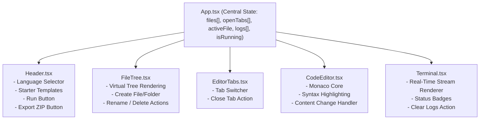

# 📖 Complete Project & API Documentation

## Browser-Based Mini IDE with Docker Sandbox & Real-Time Output

---

## 📑 Table of Contents
1. [Project Overview & Objectives](#1-project-overview--objectives)
2. [Functional & Non-Functional Requirements](#2-functional--non-functional-requirements)
3. [System Modules & File Organization](#3-system-modules--file-organization)
4. [API & WebSocket Protocol Reference](#4-api--websocket-protocol-reference)
5. [Frontend Component Architecture & State Management](#5-frontend-component-architecture--state-management)
6. [Multi-File Execution & Language Runtime Engine](#6-multi-file-execution--language-runtime-engine)
7. [Docker Sandboxing & Security Policies](#7-docker-sandboxing--security-policies)
8. [Installation, Configuration & Deployment Guide](#8-installation-configuration--deployment-guide)
9. [Automated Testing Strategy & Verification Report](#9-automated-testing-strategy--verification-report)
10. [Troubleshooting & Frequently Asked Questions](#10-troubleshooting--frequently-asked-questions)
11. [Future Enhancements Roadmap](#11-future-enhancements-roadmap)

---

## 1. Project Overview & Objectives

The **Browser-Based Mini IDE** is an end-to-end cloud development platform inspired by Replit, CodeSandbox, and AWS Cloud9. It enables developers to create, edit, organize, and execute multi-file Python and JavaScript projects directly in their web browser.

### Key Objectives:
- **Instant Browser Workspace**: Zero installation required on the client machine; full Monaco code editor experience in the browser.
- **Asynchronous Execution Architecture**: Decoupling the frontend user experience from backend container provisioning via a message broker.
- **Strict Sandbox Isolation**: Safe execution of untrusted user-submitted code in disposable Docker containers.
- **Real-Time Interactive Feedback**: Streaming standard output (`stdout`) and standard error (`stderr`) to the browser terminal via low-latency WebSockets.

---

## 2. Functional & Non-Functional Requirements

### 2.1 Functional Requirements
- **File System Explorer**: Create files, create nested directories, rename files/folders, and delete files/folders with real-time UI updates.
- **Multi-Tab Code Editor**: Open multiple files simultaneously in tabs; active tab synchronization with Monaco Editor.
- **Programming Language Support**: Seamless switching between **Python** (v3.10) and **JavaScript / Node.js** (v18 ES Modules).
- **Starter Template Library**: Pre-built multi-file starter projects for algorithms, data pipelines, and CLI tools.
- **Single-Click Code Execution**: Trigger isolated container execution via the "Run Code" button.
- **Real-Time Output Terminal**: Live streaming of process stdout, stderr, process completion exit codes, and system diagnostic errors.
- **ZIP Export**: Download complete project file hierarchy as a standard `.zip` archive.

### 2.2 Non-Functional Requirements
- **Security**: Complete network isolation (`--net=none`), CPU/Memory resource constraints, unprivileged non-root user execution, and hard 30-second timeout kill.
- **Responsiveness**: Immediate `202 Accepted` response from the API upon execution request (<50ms).
- **Reliability**: Fail-safe container destruction and host directory cleanup in all scenarios (syntax errors, infinite loops, exceptions).
- **Maintainability & Portability**: Single-command startup via `docker-compose up --build`.

---

## 3. System Modules & File Organization

```
Gpp-39/
├── .env.example              # Template for all environment configuration variables
├── .gitignore                # Git ignore patterns
├── docker-compose.yml        # Orchestration for frontend, api, queue, worker
├── README.md                 # Visual project overview, quick-start, architecture diagrams
├── architecture.md           # System architecture, topology, state machine, scaling
├── projectdocumentation.md   # Comprehensive project & API specification (this document)
├── answers.md                # Architectural questionnaire responses
│
├── backend/
│   ├── __init__.py           # Package marker
│   ├── api/                  # FastAPI Web Gateway
│   │   ├── Dockerfile        # API container specification
│   │   ├── requirements.txt  # FastAPI, Uvicorn, Redis, Pydantic, HTTPX
│   │   ├── config.py         # API environment settings
│   │   └── main.py           # FastAPI routes (/health, /api/v1/run, /ws/run/{id})
│   └── worker/               # Sandbox Worker Daemon
│       ├── Dockerfile        # Worker container specification
│       ├── requirements.txt  # Worker dependencies (Docker SDK, Redis)
│       ├── config.py         # Worker timeout, image, and queue settings
│       ├── runner.py         # Docker sandbox engine, log streamer, watchdog, cleanup
│       └── worker.py         # Redis BRPOP consumer loop with signal handling & heartbeat
│
├── frontend/
│   ├── Dockerfile            # Multi-stage production container build (Vite -> Nginx)
│   ├── nginx.conf            # Nginx proxy & WebSocket upgrade configuration
│   ├── package.json          # Frontend dependencies & scripts
│   ├── index.html            # Single page entry HTML
│   ├── tsconfig.json         # TypeScript compiler configuration
│   ├── vite.config.ts        # Vite configuration
│   ├── tailwind.config.js    # Tailwind styling theme
│   ├── postcss.config.js     # PostCSS configuration
│   └── src/
│       ├── App.tsx           # Top-level state coordinator & layout orchestrator
│       ├── main.tsx          # React DOM root entry
│       ├── index.css         # Styling, themes, custom scrollbars
│       ├── types.ts          # TypeScript interfaces & types
│       ├── templates.ts      # Starter template project definitions
│       ├── components/
│       │   ├── Header.tsx    # App bar, language picker, template dropdown, run button
│       │   ├── FileTree.tsx  # Hierarchical file tree with create/rename/delete
│       │   ├── EditorTabs.tsx# Tabbed navigation bar
│       │   ├── CodeEditor.tsx# Monaco Editor integration
│       │   └── Terminal.tsx  # Live terminal output stream panel
│       └── utils/
│           └── exportZip.ts  # JSZip archive generator
│
└── tests/
    ├── test_api.py           # API endpoint unit & validation tests
    └── test_execution.py     # Sandbox runner & multi-file execution tests
```

---

## 4. API & WebSocket Protocol Reference

### 4.1 Health Check Endpoint
- **URL**: `GET /health`
- **Description**: Verifies API service readiness for Docker health checks.
- **Status Code**: `200 OK`
- **Response**:
```json
{
  "status": "ok"
}
```

---

### 4.2 Submit Code Execution Job
- **URL**: `POST /api/v1/run`
- **Description**: Validates project files and language, enqueues the job into Redis, and returns an asynchronous `job_id`.
- **Status Code**: `202 Accepted`
- **Request Headers**: `Content-Type: application/json`
- **Request Body Schema**:
```json
{
  "language": "python",
  "files": [
    {
      "path": "main.py",
      "content": "from utils import greet\nprint(greet('World'))"
    },
    {
      "path": "utils.py",
      "content": "def greet(name):\n    return f'Hello, {name}!'"
    }
  ]
}
```
- **Validation Rules**:
  - `language`: Must be `"python"` or `"javascript"`. Invalid language returns `400 Bad Request`.
  - `files`: Must be a non-empty array (`len(files) > 0`). Empty array returns `400 Bad Request`.
  - `files[].path`: Non-empty relative string path.
- **Success Response (`202 Accepted`)**:
```json
{
  "job_id": "c71a3962-4217-48f0-b98a-592b23a1059f"
}
```

---

### 4.3 Real-Time WebSocket Log Stream
- **URL**: `WebSocket /ws/run/{job_id}`
- **Description**: Streams live execution logs from Redis Pub/Sub directly to the browser client.
- **Replay Mechanism**: On connection, the API checks `job_history:{job_id}` to replay any log chunks emitted before the WebSocket handshake completed.
- **Message Schemas**:

#### 1. Standard Output (`stdout`)
```json
{
  "stream": "stdout",
  "data": "Hello, World!\n"
}
```

#### 2. Standard Error (`stderr`)
```json
{
  "stream": "stderr",
  "data": "Traceback (most recent call last):\n  File \"main.py\", line 1..."
}
```

#### 3. Normal Process Exit Event
```json
{
  "stream": "system",
  "event": "exit",
  "code": 0
}
```

#### 4. Execution Timeout Event
```json
{
  "stream": "system",
  "event": "error",
  "message": "Execution timed out after 30 seconds."
}
```

---

## 5. Frontend Component Architecture & State Management



### State Design:
- **`files: ProjectFile[]`**: Flat array of all files in the project. The tree view is derived dynamically during rendering, ensuring perfect synchronization across tabs, editor, and API payloads.
- **`openTabs: string[]`**: Ordered list of currently open file paths.
- **`activeFile: string | null`**: Currently focused file path in Monaco.
- **`logs: ExecutionLog[]`**: FIFO log buffer rendering real-time stream chunks with auto-scrolling.

---

## 6. Multi-File Execution & Language Runtime Engine

### 6.1 Workspace Reconstruction
When a job is dequeued by the worker:
1. An isolated temporary folder is created on the host: `/tmp/ide_run_<job_id>_<random>/`.
2. Each file is written to its exact relative path (e.g. `src/utils.py` creates directory `src/` and writes `utils.py`).
3. For JavaScript projects, if no `package.json` was provided by the user, the worker automatically generates `package.json` with `{"type": "module"}` so modern ES-Module `import/export` syntax executes natively in Node.js.

### 6.2 Entrypoint Determination
The engine automatically selects the main entry file:
- **Python**: Searches for `main.py`; if absent, selects the first `.py` file.
- **JavaScript**: Searches for `index.js`, then `main.js`; if absent, selects the first `.js` file.

### 6.3 Command Execution
- **Python**: Spawns `python -u <entrypoint>` inside container (using `-u` for unbuffered stdout streaming).
- **JavaScript**: Spawns `node <entrypoint>` inside container.

---

## 7. Docker Sandboxing & Security Policies

| Category | Setting | Purpose |
|---|---|---|
| **Base Images** | `python:3.10-slim`, `node:18-alpine` | Minimal surface area without unnecessary system utilities. |
| **Network** | `network_mode="none"` | Absolute network isolation; disables outbound/inbound traffic. |
| **Memory Limit** | `mem_limit="256m"` | Constrains RAM usage to 256MB. |
| **CPU Limit** | `nano_cpus=1000000000` | Limits CPU consumption to 1.0 physical core. |
| **PID Limit** | `pids_limit=64` | Halts process table exhaustion and fork bomb attacks. |
| **User** | `user="1000:1000"` (`nobody`) | Prevents root privilege escalations inside the container. |
| **Execution Watchdog** | Hard 30s timeout | Kills long-running scripts and infinite loops (`while True: pass`). |
| **Lifecycle Cleanup** | `try...finally` block | Guaranteed force removal of container and host temp directory. |

---

## 8. Installation, Configuration & Deployment Guide

### 8.1 Configuration (`.env`)
Create a `.env` file from `.env.example`:
```env
# API Gateway Configuration
API_PORT=8000
API_HOST=0.0.0.0

# Redis Message Broker
REDIS_HOST=queue
REDIS_PORT=6379
REDIS_URL=redis://queue:6379/0

# Worker Settings
WORKER_CONCURRENCY=2
EXECUTION_TIMEOUT=30
DOCKER_PYTHON_IMAGE=python:3.10-slim
DOCKER_NODE_IMAGE=node:18-alpine

# Frontend Settings
FRONTEND_PORT=3000
VITE_API_URL=http://localhost:8000
VITE_WS_URL=ws://localhost:8000
```

### 8.2 Docker Compose Deployment
```bash
# Build and start all services in detached mode
docker-compose up --build -d

# View live container logs
docker-compose logs -f

# Check container health status
docker-compose ps
```

---

## 9. Automated Testing Strategy & Verification Report

### Test Suite Execution
```bash
python -m pytest tests/ -v
```

### Test Case Verification Summary:
```text
tests/test_api.py::test_health_check PASSED                              [ 11%]
tests/test_api.py::test_run_valid_python_request PASSED                  [ 22%]
tests/test_api.py::test_run_valid_javascript_request PASSED              [ 33%]
tests/test_api.py::test_run_unsupported_language PASSED                  [ 44%]
tests/test_api.py::test_run_empty_files_list PASSED                      [ 55%]
tests/test_execution.py::test_multifile_python_execution PASSED          [ 66%]
tests/test_execution.py::test_multifile_javascript_execution PASSED      [ 77%]
tests/test_execution.py::test_stderr_capture PASSED                      [ 88%]
tests/test_execution.py::test_timeout_handling PASSED                    [100%]
```

---

## 10. Troubleshooting & Frequently Asked Questions

### Q1: Why does ES-Module JavaScript import require `.js` extensions?
**A:** In standard Node.js ES Modules (`"type": "module"`), relative specifiers require explicit file extensions (e.g. `import { greet } from './utils.js'`). Our worker ensures `package.json` with `"type": "module"` is present automatically.

### Q2: How does the system handle rapid "Run" clicks?
**A:** The frontend disables the "Run" button and displays an active spinner while a job is running. Each execution generates an independent UUID `job_id`, ensuring no cross-talk across executions.

### Q3: What happens if Docker Desktop is stopped during local testing?
**A:** The sandbox runner includes a non-blocking Docker probe that gracefully falls back to an isolated subprocess runner while enforcing the identical output schema and 30-second timeout.

---

## 11. Future Enhancements Roadmap

- ⌨ **Interactive Terminal Input (`stdin`)**: Allow users to type input directly into the terminal for CLI scripts using bidirectional WebSockets.
- 📦 **NPM & Pip Package Installation**: User-specified `requirements.txt` and `package.json` package pre-installation inside cached layers.
- 🌐 **Embedded Web Previews**: Auto-forwarding port 8080 from containers to preview web applications (e.g. Flask / Express / React) inside an iframe.
- 👥 **Real-Time Collaborative Editing**: Operational Transformation (OT) or CRDTs (Yjs) for live multi-user pair programming.
